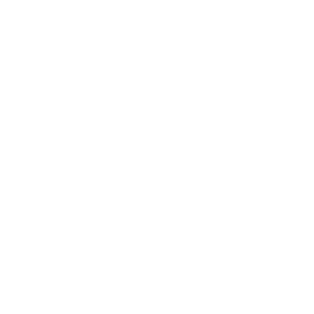
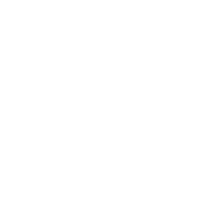

<h1 align="center">
    Artem Nostrum
</h1>

>Данный проект представляет собой реализацию векторного графического редактора с системой управления учётными записями в рамках проектно-технологической практики кафедры ИУ9 в 2022 году
## Наш сайт http://artemnostrum.yss.su

# Содержание документации
### Инсталяция проекта
* [Требуемые параметры системы](#требуемые-параметры-системы)
* [Установка](#установка)
* [Запуск](#запуск)
### Управление учётными записями
* [Регистрация](#регистрация)
* [Авторизация](#авторизация)
* [Личный кабинет](#личный-кабинет)
* [Смена почты](#смена-почты)
* [Смена пароля](#смена-пароля)
### Возможности редактора
* [Инструменты](#инструменты)
  * [ Курсор ](#курсор)
  * [ Карандаш ](#карандаш)
  * [ Линия ](#линия)
  * [Фигуры](#фигуры)
    * [ Многоугольник ](#многоугольник)
    * [ Прямоугольник ](#прямоугольник)
    * [ Эллипс ](#эллипс)
    * [ Звезда ](#звезда)
  * [ Путь ](#путь)
  * [ Текст ](#текст)
  * [ Заливка ](#заливка)
  * [ Ластик ](#ластик)
  * [ Перемещение ](#перемещение)
  * [ Вращение ](#вращение)
  * [Трансформация](#трансформация)
    * [ Деформация ](#деформация)
    * [ Масштабирование ](#масштабирование)
    * [ Разбиение ](#разбиение)
    * [ Скос ](#скос)
    * [ Отражение ](#отражение)
    * [ Расширение-сжатие ](#расширение-сжатие)
* [Отмена и повтор действий](#отмена-и-повтор-действий)
* [Слои **ГАМИД**](#слои)
* [Проекты **АНДРЕЙ**](#проекты)
### Авторство
* [Состав команды](#состав-команды)
* [Куратор](#куратор)
### Лицензия
* [MIT](#рисует-и-точка--это-пользовательский-продукт-с-открытым-исходным-кодом-распространяемый-под-лицензией-mit-license)
### Благодарность
* [Спасибо](#нашему-куратору-посевину-даниле-павловичу-большое-спасибо-за-то-что-направлял-и-вёл-наш-проект-а-также-помогал-решать-все-вопросы-касающиеся-разработки)

# Инсталяция проекта
Инструкции ниже помогут вам загрузить и запустить копию проекта для личного использования на вашей локальной машине.
### Требуемые параметры системы
* python: 3.8.10 и выше
* для unix обязательно иметь пакет python3-venv
### Установка
1. **Скопируйте репозиторий в вашу директорию и перейдите в корень проекта**
    ```shell
    $ git clone <репозиторий> --branch=main
    $ cd ptp2022-7-svg-editor
    ```
2. **Создайте виртуальную среду и активируйте ее**
    ```shell
    $ python3 -m venv venv
    $ source venv/bin/activate
    ```
    <details>
    <summary>Windows</summary>

    ```shell
    > python -m venv venv
    > venv\Scripts\activate
    ```
    </details>
3. **Установите зависимости**
    ```shell
    (venv) $ python3 -m pip install --upgrade pip
    (venv) $ pip install -r requirements.txt
    ```
4. **Сделайте миграции**
    ```shell
    (venv) $ python manage.py migrate
    ```
### Запуск
```shell
(venv) $ python manage.py runserver
```

# Управление учётными записями
Для работы в редакторе необходимо создать учётную запись, с которой вы сможете хранить созданные файлы на сервере, открывать их для продолжения работы, а также импортировать файлы со своего компьютера.
## Регистрация
* Если у вас ещё нет учётной записи, перейдите на страницу регистрации, нажав на ссылку на странице авторизации.
* 
* Следуя инструкциям, заполните необходимые поля на странице регистрации.
* 
* После создания учётной записи необходимо подтвердить адрес электронной почты, указанный при регистрации. Вам будет выслано письмо с ссылкой, после нажатия на которую откроется страница, уведомляющая о подтверждении адреса.
* 
## Авторизация
* При наличии учётной записи заполните поля на странице авторизации для начала работы.
* 
* Если вы забыли пароль к своей учётной записи, нажмите на соответсвующую ссылку.
* 
  * Заполните поле, введя электронный адрес. Письмо с ссылкой на страницу восстановления пароля будет отправлено на указанный адрес, если к нему привязана существующая учётная запись.
  * 
  * Заполните поля на странице восстановления пароля.
  * 
## Личный кабинет
* После авторизации открывается личный кабинет пользователя, где вы можете сменить пароль, выйти из учётной записи или приступить к работе в редакторе.
* 
## Смена пароля
* Для смены пароля нажмите на соответствующую ссылку в личном кабинете.
* Заполните поля, следуя инструкциям.

* После смены пароля откроется страница, уведомляющая об успешной смене пароля.
* 

# Возможности редактора
## **Инструменты**
* Все инструменты, кроме курсора, не реагируют на нажатия мыши за пределами холста.
* После окончания рисования любым инструментом, кроме зеркала, действующий объект выделяется линиями голубого цвета.
* При любом активном действии на панели параметров или инструментов или после нажатия клавиши `Esc` выделения стираются и в случае, если использование инструмента не было закончено, последнее действие безвозвратно отменяется.
* `Объектом на координатах` далее будет обозначаться объект, которому принадлежит точка с данными координатами, лежащий на активном слое и для которого не найдётся другого объекта на активном слое такого, что ему так же будет принадлежать данная точка и он будет находиться выше первого.
### Курсор
* При нажатии ЛКМ[^lkm] не дальше 30-ти пикселей хотя бы от одной из границ холста эта или эти границы становятся сдвигаемыми движениями курсора мыши с зажатой клавишой. При этом все объекты холста не меняют местоположения относительно страницы.
* В случае, если таких границ не нашлось, и координаты нажатия мыши пришлись на холст, за любым последующим движением курсора мыши следует перемещение холста вместе с его содержимым по странице.
* 
### Карандаш
* При зажатой ЛКМ[^lkm] происходит рисование полилинии по тем точкам, на которых было зафиксировано движение курсора мыши с зажатой клавишей.
* В случае клика мышки без её перемещения объект не создаётся.
* 
### Линия
* При нажатии ЛКМ[^lkm] устанавливаются две точки линии.
* При движении курсора мыши с зажатой ЛКМ перемещается вторая точка.
* При отпускании ЛКМ рисование заканчивается.
* 
### _Фигуры_
#### Многоугольник
* При первом нажатии ЛКМ[^lkm] устанавливаются первые две точки многоугольника.
* При движении с зажатой кнопкой изменяются координаты последней точки многоугольника.
* После очередного нажатия ЛКМ в конец массива точек многоугольника добавляется новая точка.
* При перемещении курсора мышки без зажатой ЛКМ более чем на 10 пикселей от последней установленной точки рисование прекращается.
* 
#### Прямоугольник
* При нажатии ЛКМ[^lkm] устанавливаются две точки, обозначающие противоположенные углы прямоугольника.
* При движении курсора мыши с зажатой ЛКМ перемещается вторая точка.
* При отпускании ЛКМ рисование заканчивается.
* 
#### Эллипс
* При нажатии ЛКМ[^lkm] устанавливаются две точки, обозначающие противоположенные углы прямоугольника, в который вписан эллипс.
* При движении курсора мыши с зажатой ЛКМ перемещается вторая точка.
* При отпускании ЛКМ рисование заканчивается.
* 
#### Звезда
* При нажатии ЛКМ[^lkm] устанавливаются две точки, обозначающие противоположенные углы прямоугольника, в который вписана правильная пятиконечная звезда.
* При движении курсора мыши с зажатой ЛКМ перемещается вторая точка.
* При отпускании ЛКМ рисование заканчивается.
* 
### Путь
* При первом нажатии ЛКМ[^lkm] создаётся кривая Безье[^bezier_curve] с началом, концом и контрольными точками на координатах курсора мыши.
* При движении курсора мыши с зажатой кнопкой изменяются координаты контрольной точки конца последней кривой на координаты курсора мыши и, если последняя кривая не первая, изменяются координаты контрольной точки конца предпоследней кривой на координаты курсора мыши, противоположенные относительно конца предпоследней кривой.
* При движении курсора мыши с отпущенной ЛКМ меняются координаты конца и контрольной точки конца последней кривой.
* При очередном нажатии ЛКМ создаётся новая кривая Безье[^bezier_curve] с началом в конце предыдущей, контрольной точкой начала на координатах, противоположенных координатам контрольной точки конца предыдущей кривой относительно её конца, и концом и контрольной точкой конца на координатах курсора мыши.
* После установки конца очередной кривой на расстоянии от начала первой кривой не более 10-ти пикселей координаты конца последней кривой становятся равными координатам начала первой кривой и координаты контрольной точки конца последней кривой становятся равными координатам точки, противоположенной координатам контрольной точки начала первой кривой относительно её начала, и рисование заканчивается.
* В случае установки конца очередной кривой на координатах её начала, последняя кривая удаляется и рисование заканчивается.
*  
### Текст
* При нажатии ЛКМ[^lkm] устанавливаются две точки, обозначающие противоположенные углы прямоугольника, в который будет вписан текст.
* При движении курсора мыши с зажатой ЛКМ перемещается вторая точка.
* При отпускании ЛКМ рисование заканчивается, запрашивается текст и создаётся текст выстой, равной высоте описанного прямоугольника, и с содержанием, включающим максимальное количество первых символов исходного текста, при которых ширина строки в пикселях не превышает ширину исходного прямоугольника.
* 
### Заливка
* При нажатии ЛКМ[^lkm] объекту на координатах[^object_on_coords] присваиваются новые параметры из панели параметров и инструментов: наличие заполнения, цвет заполнения, цвет контура и ширина контура.
* 
### Ластик
* При нажатии ЛКМ[^lkm] объект на координатах[^object_on_coords] удаляется.
* При движении курсора мыши с зажатой ЛКМ повторяется эффект нажатия ЛКМ.
* 
### Перемещение
* При нажатии ЛКМ[^lkm] объект на координатах[^object_on_coords] привязывается к движениям курсора мыши и имеет равную ей дельту перемещения.
* 
### Вращение
* При перемещении курсора мыши с зажатой ЛКМ[^lkm] объект на координатах[^object_on_coords] совершает поворот относительно своего центра на угол, равный углу перемещения курсора мыши относительно центра объекта.
* 
### _Трансформация_
#### Деформация
* После первого клика ЛКМ[^lkm] каждая точка объекта на координатах[^object_on_coords] выделяется кружком синего цвета, а если объект является путём, то так же выделяются все контрольные точки с привязкой голубыми прямыми к соответствующим им началам и концам кривых.
* Каждая выделенная точка является перемещаемой курсором мыши.
*  
#### Масштабирование
* После первого клика ЛКМ[^lkm] объект на координатах[^object_on_coords] выделяется голубым параллелограммом с синими кружками на углах и серединах его сторон.
* После перемещения одного из кружков масштаб объекта меняется с центром в точке, противоположенной перемещённой относительно центра объекта, и коэффициентом, равным отношению расстояния от противоположенной точки до перемещённой к расстоянию от противоположенной точки до проекции координат курсора мыши на прямую, соединяющую перемещённую точку с центром объекта.
* 
#### Разбиение
* При нажатии ЛКМ[^lkm] по объекту на координатах[^object_on_coords], если этот объект является путём, прямоугольником или эллипсом, он преобразуется в полилилнию с частотой изгибов, равной значению параметра ширины контура на панели параметров рисования.
* 
#### Скос
* После первого клика ЛКМ[^lkm] объект на координатах[^object_on_coords] выделяется голубым параллелограммом с синими кружками на углах и серединах его сторон.
* После перемещения кружка на ребре параллелограмма объект скашивается со статичным ребром, противоположенным схваченному, и изменяемому своё положение на холсте схваченному ребру.
* При перемещении кружка на углу параллелограмма создаётся искажение, подобное захвату двух кружков на центрах смежных углу рёбер.
* 
#### Отражение
* При первом нажатии ЛКМ[^lkm] устанавливаются два синих кружочка и голубая линия между ними.
* При движении курсора мыши с зажатой ЛКМ перемещается второй кружок.
* После отпускания ЛКМ мыши кружочки остаются перемещаемыми.
* При очередном нажатии ЛКМ объект на координатах[^object_on_coords] отражается относительно прямой, отрисованной ранее.
* 
#### Расширение-сжатие
* После первого клика ЛКМ[^lkm] объект на координатах[^object_on_coords] выделяется голубым параллелограммом с синими кружками на углах и серединах его сторон.
* После перемещения одного из угловых кружков ширина и высота объекта изменяются в соответствии с отношением ширины и высоты прямой, соединяющей схваченный кружок с противоположенным ему относительно центра объекта, к прямой, соединяющей координаты курсора мыши с противоположенным кружком.
* В случае, если перемещён был кружок с горизонтальной грани, изменяется только высота объекта, а если вертикальной — ширина.
* 
## Отмена и повтор действий
* Сочетание клавиш `ctrl`+`z` отменяет последнее совершённое действие, если это возможно.
* В свою очередь, `ctrl`+`shift`+`z` воспроизводит последнее отменённое действие, если такое существует.
* История рисования линейна, поэтому после фиксации нового действия, если до этого были не воспроизведённые отменённые действия, они стираются.
## Слои
> Следует описать принцип работы системы слоёв, чтобы прочитав этот абзац можно было понять неподготовленному пользователю
## Проекты
Графический редактор позволяет открывать несколько файлов одновременно и удобно переключаться между ними.
## Открытие файла
* Под открытием файла подразумевается загрузка его содержимого с сервера на клиент с возможностью его последующего редактирования.
* Открытие нового файла происходит при первичной загрузке страницы редактора, создании нового файла или выборе уже существующего.
* Также при каждой такой загрузке внизу интерфейса редактора появляется соответствующий идентификатор файла.
## Переключение между файлами
* Идентификатор текущего активного файла подсвечивается синим, если вы хотите переключиться на другой файл, вам вселишь нужно нажать на идентификатор интересующего вас файла.
## Закрытие файлов
* Для закрытия ненужного файла, необходимо нажать на крестик в правом нижнем углу его идентификатора. 
* При этом новым активным файлом будет выбран первый открытый вами файл.
* Будьте аккуратны закрытие файла не сопровождается сохранением изменений, поэтому при закрытии несохраненного файла все изменения будут потеряны.
* Также если на странице редактора не останется открытых файлов, то автоматически произойдет переадресация на страницу аккаунта.
## Особенности поведения
* При попытке открыть уже открытый файл редактор позволит вам это сделать, однако при этом будут утеряны все несохраненные изменения.
* При удалении с сервера открытого в редакторе файла, его идентификатор останется и с файлом можно будет продолжить работать и сохранить его снова.
## Быстрое сохранения
* Для быстрого сохранения изменений в активном файле необходимо нажать `ctrl+x`
# Управление учётными записями
Для работы в редакторе необходимо создать учётную запись, с которой вы сможете хранить созданные файлы на сервере, открывать их для продолжения работы, а также импортировать файлы со своего компьютера.
## Регистрация
* Если у вас ещё нет учётной записи, перейдите на страницу регистрации, нажав на ссылку на странице авторизации.  
* 
* Следуя инструкциям, заполните необходимые поля на странице регистрации.
* 
* После создания учётной записи необходимо подтвердить адрес электронной почты, указанный при регистрации. Вам будет выслано письмо с ссылкой, после нажатия на которую откроется страница, уведомляющая о подтверждении адреса.
* 
## Авторизация
* При наличии учётной записи заполните поля на странице авторизации для начала работы.
* 
* Если вы забыли пароль к своей учётной записи, нажмите на соответсвующую ссылку.
* 
  * Заполните поле, введя электронный адрес. Письмо с ссылкой на страницу восстановления пароля будет отправлено на указанный адрес, если к нему привязана существующая учётная запись.
  * 
  * Заполните поля на странице восстановления пароля.  
  * 
## Личный кабинет
* После авторизации открывается личный кабинет пользователя, где вы можете сменить пароль, выйти из учётной записи или приступить к работе в редакторе. 
* 
## Смена пароля
* Для смены пароля нажмите на соответствующую ссылку в личном кабинете.
* Заполните поля, следуя инструкциям.  

* После смены пароля откроется страница, уведомляющая об успешной смене пароля.
* 

# Авторство
### Состав команды:
* Виленский Сергей Дмитриевич — _руководитель проекта и `JavaScript` разработчик_ — **[AngelicHedgehog](https://github.com/AngelicHedgehog)**
* Фёдоров Владислав Павлович — _`html` и `JavaScript` разработчик_ — **[GarryNeKasparov](https://github.com/GarryNeKasparov)**
* Гасаев Гамид Казимович — _`JavaScript` разработчик_ — **[wizardOfOz21](https://github.com/wizardOfOz21)**
* Выдрина Варвара Алексеевна — _дизайнер и `html` разработчик_ — **[vyydra](https://github.com/vyydra)**
* Сатыбалдиев Талгат — _дизайнер и архитектор_ — **[@SatybaldievT](https://github.com/SatybaldievT)**
* Кабанов Андрей Юрьевич — _`Python` и `JavaScript` разработчик_ — **[Kabane-UN](https://github.com/Kabane-UN)**
### Куратор:
* Посевин Данила Павлович — **[@posevin](https://github.com/posevin)**

# Лицензия
### Рисует и точка — это пользовательский продукт с открытым исходным кодом, распространяемый под лицензией [MIT License](./LICENSE).

# Благодарность
### Нашему куратору Посевину Даниле Павловичу большое спасибо за то, что направлял и вёл наш проект, а также помогал решать все вопросы, касающиеся разработки!!!
[^object_on_coords]: Объект на координатах — это объект, которому принадлежит точка с данными координатами, лежащий на активном слое и для которого не найдётся другого объекта на активном слое такого, что ему так же будет принадлежать данная точка и он будет находиться выше первого.
[^lkm]: ЛКМ — аббревиатура от "левая клавиша мыши".
[^bezier_curve]: https://ru.wikipedia.org/wiki/Кривая_Безье.